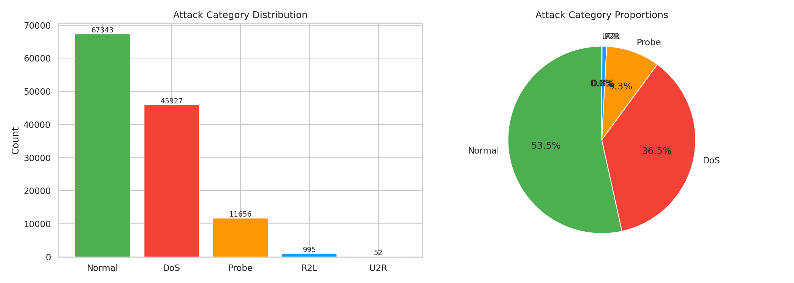
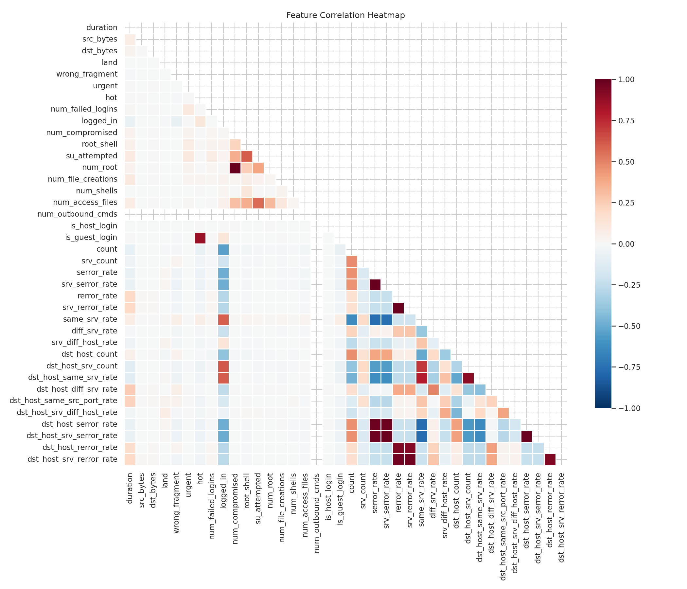
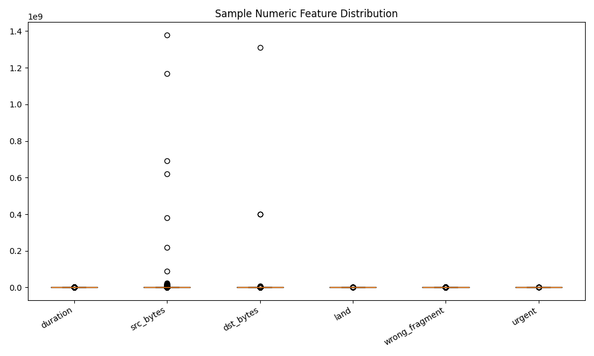
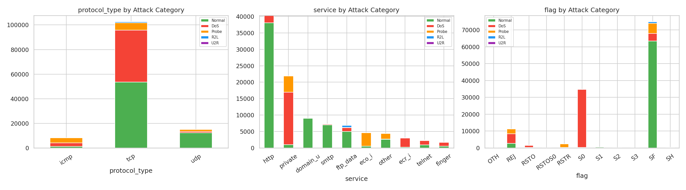
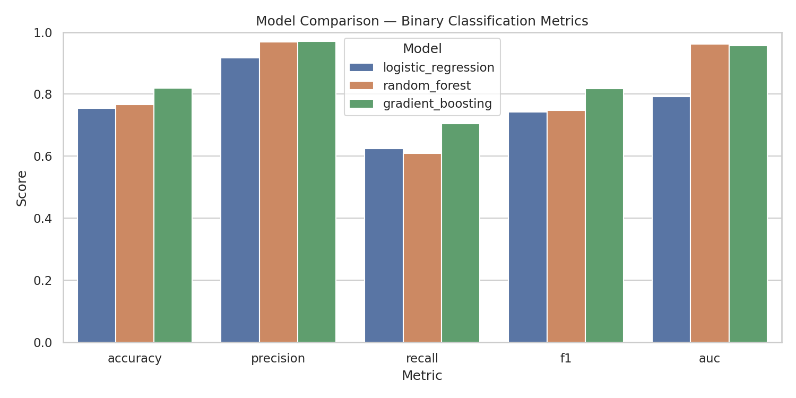
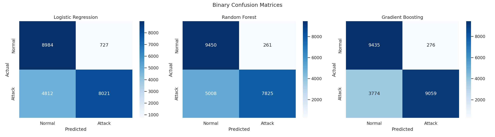
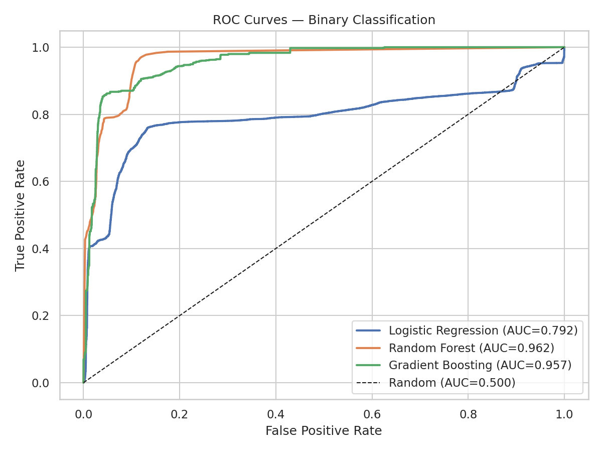
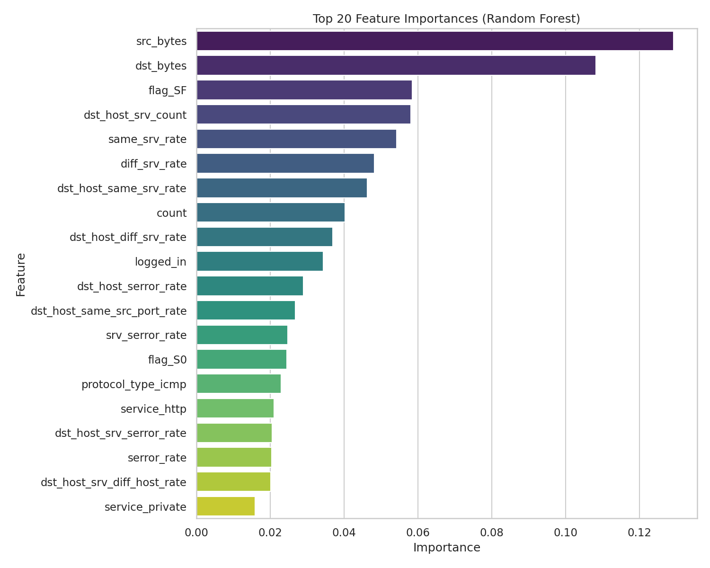
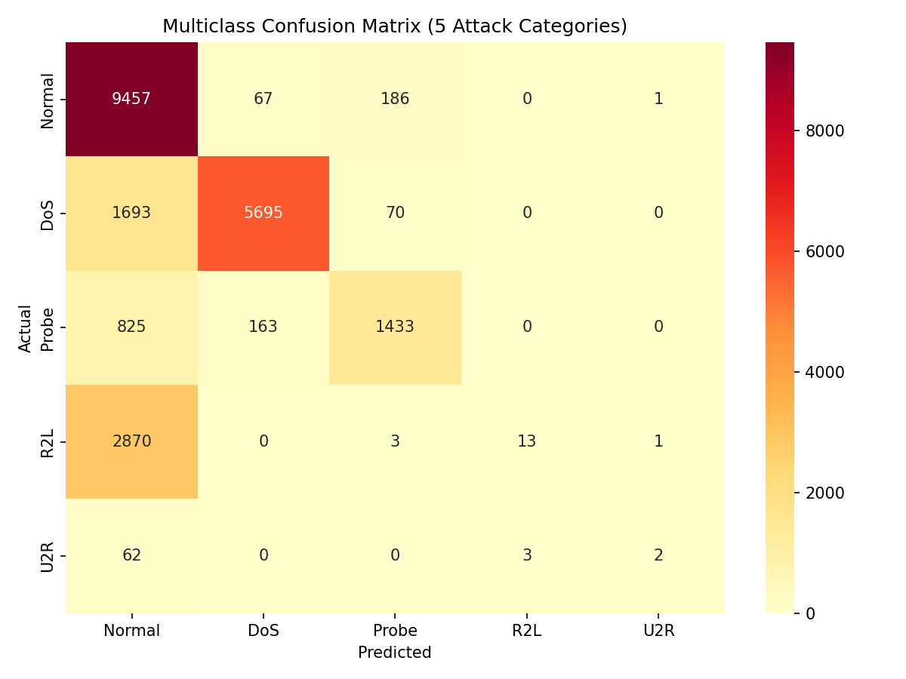

# ML Group Project Presentation

## Slide 1: Title Slide

* **Project:** Machine Learning for Network Intrusion Detection with NSL-KDD
* **Course:** AAI 6600 — Applied Artificial Intelligence
* **Group members:** Will Daly, Wei Dong, Zahra Joulaei
* **Date:** April 7th, 2026

**Opening line:** Our project asks whether machine learning can detect malicious network traffic early enough to support a real security operations workflow.

---

## Slide 2: Business Problem

* Enterprise networks generate too many connections for manual review.
* Security teams need to catch attacks without overwhelming analysts with false alarms.
* **Business question:** Can we automatically flag suspicious connections while keeping the alert stream usable?
* **Why ML:** The data is high-volume, high-dimensional, and contains nonlinear relationships.

**Presenter note:** Frame this as an operations decision problem, not just a classification exercise.

---

## Slide 3: Dataset And Why We Chose It

* **Dataset:** NSL-KDD (cleaned successor to KDD Cup 1999)
* **Files used:** `KDDTrain+.txt` and `KDDTest+.txt`
* **Rows:** 125,973 train + 22,544 test = 148,517 total
* **Columns:** 41 predictive features plus `label` and `difficulty_level`
* **Five attack categories:** Normal, DoS, Probe, R2L, U2R

**Citation footer:** Tavallaee et al. (2009); Kaggle mirror: `hassan06/nslkdd`

---

## Slide 4: EDA — Data Quality

* Combined train/test summary: **0 missing values**, **0 duplicate rows**
* 23 fine-grained attack labels mapped to 5 standard categories
* Key finding: **severe class imbalance** — Normal + DoS = 85%+ of data; U2R < 0.1%



---

## Slide 5: EDA — Correlation & Redundant Features

* Correlation heatmap revealed redundant feature pairs (e.g., `serror_rate` / `srv_serror_rate`)
* Suggests future feature selection could reduce dimensionality without losing signal



---

## Slide 6: EDA — Numeric Feature Distributions

* Key features (`src_bytes`, `duration`) are heavily right-skewed
* Attack traffic is characterized by **extreme outliers**, not just different averages
* Skew reflects real attack behavior — not bad data



---

## Slide 7: EDA — Categorical Feature Patterns

* TCP protocol dominates DoS attacks; ICMP is common for Probe
* A handful of services (`http`, `private`, `smtp`) account for most traffic
* Flag distributions differ sharply between Normal and attack categories



---

## Slide 8: ML Methodology

* **Three models compared** with class-imbalance handling:
  1. Logistic Regression (`class_weight='balanced'`) — interpretable baseline
  2. Random Forest (`class_weight='balanced'`, 300 trees) — nonlinear ensemble
  3. Gradient Boosting (100 estimators, subsample=0.8) — sequential error correction
* **Preprocessing:** One-hot encoding for categoricals, median imputation + StandardScaler for numerics
* **Evaluation:** Accuracy, Precision, Recall, F1, AUC, Confusion Matrix

---

## Slide 9: Binary Classification Results

| Model | Accuracy | Precision | Recall | F1 | AUC |
| --- | --- | --- | --- | --- | --- |
| Logistic Regression | 0.7543 | 0.9169 | 0.6250 | 0.7433 | 0.7915 |
| Random Forest | 0.7663 | 0.9677 | 0.6098 | 0.7481 | 0.9623 |
| **Gradient Boosting** | **0.8204** | **0.9704** | **0.7059** | **0.8173** | **0.9570** |

**Key takeaway:** Gradient Boosting achieved the best balance — catching 70% of attacks while maintaining 97% precision.

---

## Slide 10: Model Comparison



---

## Slide 11: Confusion Matrices



---

## Slide 12: ROC Curves

* Both tree-based models achieve AUC > 0.95
* Logistic Regression lags at AUC 0.79 — nonlinear relationships reward flexible models



---

## Slide 13: Feature Importance

* Top predictive features from Random Forest:
  * Service-related one-hot features (e.g., `service_http`, `service_private`)
  * Error rates (`serror_rate`, `srv_serror_rate`)
  * Connection statistics (`src_bytes`, `dst_host_srv_count`)
* Aligns with EDA findings — the features that showed visual separation are the ones the model relies on



---

## Slide 14: Multiclass Attack-Category Results

| Category | Precision | Recall | F1 | Support |
| --- | --- | --- | --- | --- |
| Normal | 0.63 | 0.97 | 0.77 | 9,711 |
| DoS | 0.96 | 0.76 | 0.85 | 7,458 |
| Probe | 0.85 | 0.59 | 0.70 | 2,421 |
| R2L | 0.81 | 0.00 | 0.01 | 2,887 |
| U2R | 0.50 | 0.03 | 0.06 | 67 |

Overall multiclass accuracy: **0.7363**

---

## Slide 15: Why R2L and U2R Are Nearly Undetectable



**Critical insight:** U2R had only **52 total training examples** across 4 attack types; R2L had **995**, with 890 from a single type (`warezclient`). Together just **0.83% of training data** — too few to learn reliable decision boundaries.

---

## Slide 16: Prescriptive Recommendations

1. **Deploy Gradient Boosting** as the primary binary detection filter
2. **Tune the decision threshold** based on operational priorities (catch more vs. fewer false alarms)
3. **Monitor top features** (service, error rates, connection stats) for drift
4. **Invest in R2L/U2R-specific detection** using anomaly detection, SMOTE, or cost-sensitive learning
5. **Establish feedback loops** between predictions and analyst outcomes (MLOps Monitor/Maintain)
6. **Extend to multiclass routing** so different attack types trigger different response workflows

---

## Slide 17: APLC Framework Alignment

* **Business Quadrant:** Framed the intrusion detection problem, scoped to NSL-KDD, organized team roles
* **Data Engineering Quadrant:** Comprehensive EDA with 6 visualization sets, attack-category mapping, class-imbalance analysis
* **Modeling Quadrant:** Three models with class weighting, binary + multiclass evaluation, iterative improvement
* **Software Engineering Quadrant:** Reproducible `main.py` pipeline, modular source code, automated outputs

---

## Slide 18: Conclusion

* ML can meaningfully support network intrusion detection — Gradient Boosting achieves 0.82 accuracy / 0.71 recall / 0.97 precision
* Binary detection is the practical deployment approach; multiclass categorization needs more work for rare attacks
* The project provides a reproducible end-to-end workflow from data loading through recommendations
* **Next steps:** SMOTE for rare attacks, threshold tuning, real-time pipeline prototype

---

## Appendix: Code Snippets

```python
# Run the full pipeline
python main.py --data-dir data/nsl-kdd --output-dir outputs

# Key preprocessing (src/train_models.py)
ColumnTransformer([
    ("categorical", Pipeline([SimpleImputer("most_frequent"), OneHotEncoder(handle_unknown="ignore")]), cat_cols),
    ("numeric", Pipeline([SimpleImputer("median"), StandardScaler()]), num_cols),
])

# Class-weighted Random Forest
RandomForestClassifier(n_estimators=300, class_weight="balanced", random_state=42)
```
